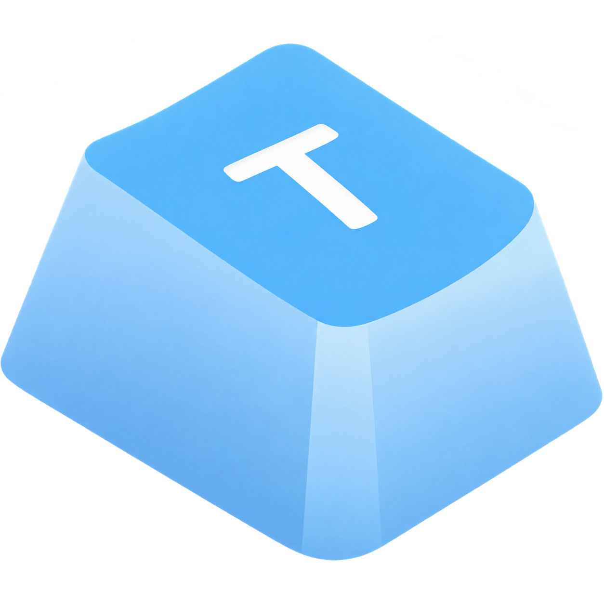
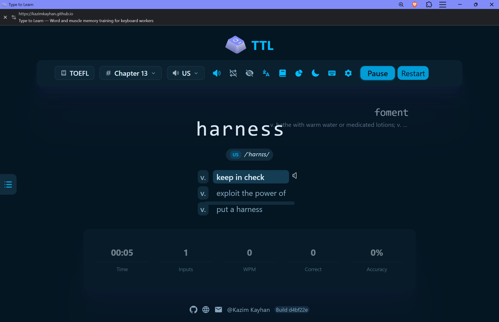
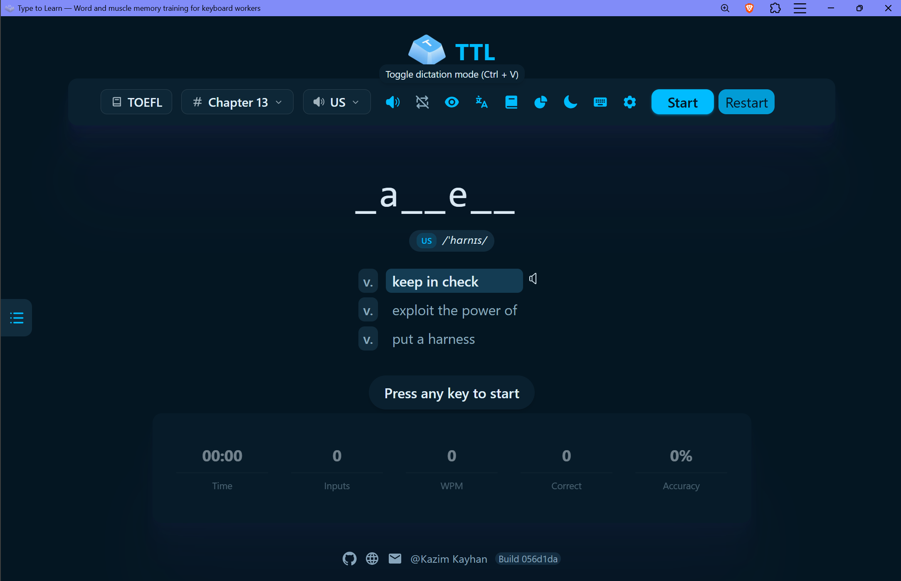
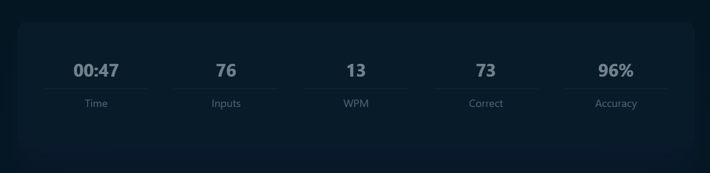

<div align="center">
  

  <h1>Type to Learn</h1>

  <p>
    Learn English vocabulary and build real typing muscle memory —
    <br />
    at the same time, in the same keystroke.
  </p>

  <p>
    <a href="https://github.com/kazimkayhan/type-to-learn/blob/master/LICENSE">
      
    </a>
    <a href="https://github.com/kazimkayhan/type-to-learn/actions/workflows/deploy-pages.yml">
      
    </a>
    <a href="https://kazimkayhan.github.io/type-to-learn/">
      
    </a>
    <a href="./CONTRIBUTING.md">
      
    </a>
    
  </p>

  <p>
    <a href="https://kazimkayhan.github.io/type-to-learn/"><strong>Try it live →</strong></a>
  </p>

  
</div>

<br />

## Why Type to Learn

If English isn't your first language, you've probably noticed you type faster in your native language than in English. That's not a vocabulary problem — it's a [muscle memory][mm] problem. Years of typing your own language build a reflex that English words never get a chance to form.

**Type to Learn** closes that gap by fusing vocabulary study with typing drills into one loop: you see a word, hear it, learn its meaning, and type it — and if you slip up, you retype the *whole word* from scratch, so your fingers only ever learn the correct pattern.

It's built for:

- **Language learners** prepping for TOEFL, IELTS, GRE, GMAT, SAT, CET, and similar computer-based exams
- **Developers** who want fluent recall of programming vocabulary and common language/framework APIs
- **Anyone** who wants typing speed and vocabulary to grow together instead of separately

[mm]: https://en.wikipedia.org/wiki/Muscle_memory

## Features

**Correct-by-construction muscle memory** — mistype a word and the app makes you clear it and retype it in full, so incorrect keystroke patterns never get a chance to stick.

**380+ built-in dictionaries** — exam vocabulary (CET-4/6, GRE, GMAT, IELTS, SAT, TOEFL, BEC, New Concept English, and more), programming vocabulary and API references (JavaScript, Node.js, Java, C#, Go, Python, Rust, Linux commands), and vocabulary for other languages (Japanese N1–N5, German, Kazakh, Indonesian, and more).

**IPA and pronunciation** — every word shows its [IPA][ipa] transcription and plays audio, so you learn spelling and pronunciation in the same pass.

**Dictation mode** — after finishing a chapter, the app quizzes you by ear on what you just learned, closing the loop from typing to listening recall.

<div align="center">
  
</div>

**Live speed and accuracy tracking** — WPM and accuracy update as you type, so progress is visible, not just felt.

<div align="center">
  
</div>

**Error book** — every word you mistype is logged automatically, so you can revisit and drill exactly your weak spots instead of re-running whole chapters.

**Progress analysis** — charts and stats (powered by ECharts) track your history over time, chapter by chapter.

**Runs anywhere** — a client-only web app (installable as a PWA, deployable to GitHub Pages) with all progress stored locally via IndexedDB, plus a native desktop shell built on Tauri/Rust for the same experience off the browser.

[ipa]: https://en.wikipedia.org/wiki/International_Phonetic_Alphabet

## Dictionaries

A sample of what's included out of the box — see the in-app dictionary picker or [`src/resources/dictionary.ts`](./src/resources/dictionary.ts) for the full, current list:

| Category | Examples |
| --- | --- |
| English exams | CET-4, CET-6, GMAT, GRE, IELTS, SAT, TOEFL, postgraduate entrance exams |
| English education | High school / middle school English, New Concept English, Business English (BEC) |
| Programming | Common programming vocabulary, JavaScript, Node.js, Java, C#, Go, Python, Rust, Linux commands |
| Other languages | Japanese (N1–N5), German, Kazakh, Indonesian, and more |

Don't see a dictionary you need? Request one via [GitHub Issues](https://github.com/kazimkayhan/type-to-learn/issues) or [contribute it yourself](./toBuildDict.md).

## Getting started

### Requirements

- **Node.js** ≥ 26
- **pnpm** ≥ 9 (this repo is pinned to `pnpm@12.4.2`)
- **Git**

### Run it locally

```sh
git clone https://github.com/kazimkayhan/type-to-learn.git
cd type-to-learn
pnpm install
pnpm dev
```

Vite serves the app under the `/type-to-learn/` base path (matching the GitHub Pages deployment), so open:

```text
http://localhost:5173/type-to-learn/
```

### Build for production

```sh
pnpm build
```

Output is written to `dist/`, pre-configured for GitHub Pages at `/type-to-learn/`.

### Other useful commands

| Command | What it does |
| --- | --- |
| `pnpm check` | Lint with Ultracite (Biome) |
| `pnpm fix` | Auto-fix lint/formatting issues |
| `pnpm knip` | Find unused files, exports, and dependencies |

### Desktop shell

A native desktop build lives in [`src-tauri/`](./src-tauri) (Tauri + Rust) around the same web UI. It's early-stage — most active development happens in `src/`.

## Tech stack

React 19 · TypeScript · Vite · Tailwind CSS v4 · Jotai · Dexie (IndexedDB) · Base UI · ECharts · Tauri

The app is entirely client-side — no backend, no accounts. Your progress lives in your browser's IndexedDB via Dexie, and you can export/import it at any time.

## Contributing

Contributions are very welcome, whether that's fixing a bug, adding a dictionary, improving docs, or proposing a feature.

Please read the [Contributing Guide](./CONTRIBUTING.md) before opening a pull request — it covers the branch workflow, code style, and (importantly) how to add a new dictionary correctly, including licensing considerations for third-party word lists.

If you're adding a dictionary, start here: [How to Import a New Dictionary](./toBuildDict.md).

## License

Type to Learn is licensed under the [GNU General Public License v3.0](./LICENSE).

## Author

**Kazim Kayhan**

- LinkedIn: [@kazimkayhan](https://www.linkedin.com/in/kazimkayhan)
- GitHub: [@kazimkayhan](https://github.com/kazimkayhan)
- Email: [email4kazim@gmail.com](mailto:email4kazim@gmail.com)
