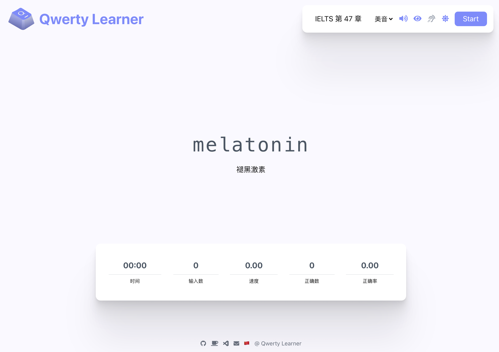
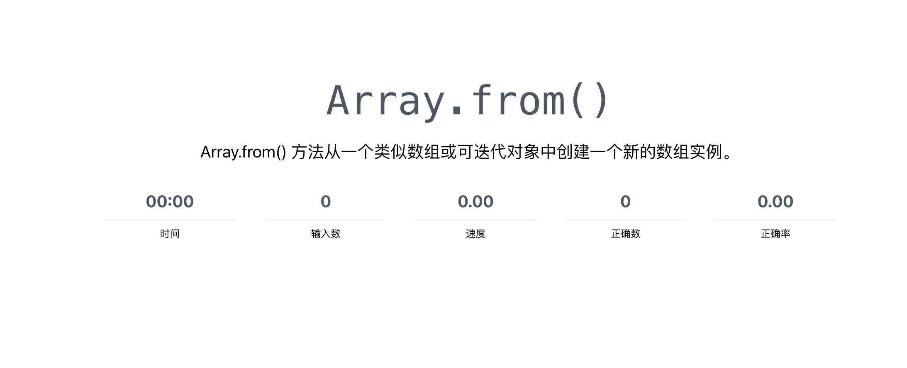

<div align=center>
  
</div>

<h1 align="center">
  Type to Learn
</h1>
<p align="center">
  Designed for people who want to memorize words and practice typing.
</p>

<p align="center">
  <a href="https://github.com/kazimkayhan/type-to-learn/blob/master/LICENSE">
    
  </a>
  <a>
    
  </a>
  <a>
    
  </a>
</p>

<div align="center">
  
</div>

## 📸 Online Access

**Live Site**: <https://kazimkayhan.github.io/type-to-learn/>

## ✨ Design Goals

Type to Learn is designed for people who type English in their daily work where English is not their mother tongue. It is common for them to type faster in their native language than in English. This is mainly because they have built a strong [muscle memory][mm] through years of typing in their native language. Their muscle memory of English words and phrases is relatively weak, leading to hesitation when typing in English.

To consolidate English typing skills, continuous vocabulary practice is essential. Type to Learn combines vocabulary memorization with typing practice, helping you build muscle memory while learning words.

To avoid forming incorrect muscle memory, the software requires you to re-enter the entire word if you make any mistakes, ensuring correct muscle memory formation.

Type to Learn is particularly useful for people taking computer-based English tests such as TOEFL, GRE, and similar examinations.

It's also helpful for developers, featuring built-in dictionaries of words and phrases common in code and documentation, plus API dictionaries for many programming languages to help developers familiarize themselves with common APIs.

<div align="center">
  
</div>

[mm]: https://en.wikipedia.org/wiki/Muscle_memory

## 🛠 Features

### Built-in Dictionaries

Type to Learn includes many built-in dictionaries for different purposes (examinations, learning, and skill levels), plus dictionaries for developers covering common programming words and API references.

### IPA and Pronunciation

While typing, the app displays the [IPA][ipa] of the current word and provides pronunciation, helping you learn both spelling and pronunciation together.

[ipa]: https://en.wikipedia.org/wiki/International_Phonetic_Alphabet

### Dictation Mode

After completing a chapter, the app prompts you to practice dictation, reinforcing the words learned in that chapter.

<div align=center>
  
</div>

### Speed and Accuracy

The app tracks your typing speed and accuracy in real-time, giving you measurable feedback on your progress.

<div align=center>
  
</div>

## 📕 Dictionaries

The app includes a comprehensive collection of dictionaries, including but not limited to:

### English Learning
- CET-4, CET-6 (College English Test)
- GMAT, GRE, IELTS, SAT, TOEFL
- Postgraduate entrance exams
- High school and middle school English
- Business English, BEC
- New Concept English series

### Programming
- Common programming vocabulary
- JavaScript, Node.js, Java, C#, Go, Python, Rust APIs
- Linux commands

### Other Languages
- Japanese vocabulary (N1-N5)
- Kazakh basic vocabulary
- German, Indonesian, and more

For the complete dictionary list, check the in-app dictionary selection or visit `src/resources/dictionary.ts`.

If you need additional dictionaries, feel free to request them via GitHub Issues or contribute your own.

## 🏄‍♂️ How to Contribute

We welcome contributions! You can participate by:

- Submitting Issues to report bugs or suggest features
- Submitting Pull Requests to improve code or add features
- Contributing new dictionaries (see [Adding Dictionaries](./toBuildDict.md))

Please read the [Contribution Guidelines](./CONTRIBUTING.md) before contributing.

## 🚀 Running the Project

This project is built with **Vite + React + TypeScript + Tailwind CSS + shadcn/ui**.

### Requirements

- **Node.js**: >=26
- **pnpm**: >=9 (recommended: pnpm@12.4.2)
- **Git**

### Installation

1. Clone the repository:
   ```sh
   git clone https://github.com/kazimkayhan/type-to-learn.git
   cd type-to-learn
   ```

2. Install dependencies:
   ```sh
   pnpm install
   ```

3. Start the development server:
   ```sh
   pnpm start
   # or
   pnpm dev
   ```

4. Open `http://localhost:5173/` in your browser

### Build for Production

```sh
pnpm build
```

The build output will be in the `dist/` directory, configured for GitHub Pages with base path `/type-to-learn/`.

## 📄 License

This project is licensed under the [GPL-3.0](../LICENSE) license.

## 🙏 Acknowledgements


## 👤 Author

**Kazim Kayhan**

- Website: [kazimjan.com](https://kazimjan.com)
- GitHub: [@kazimkayhan](https://github.com/kazimkayhan)
- Email: email4kazim@gmail.com
