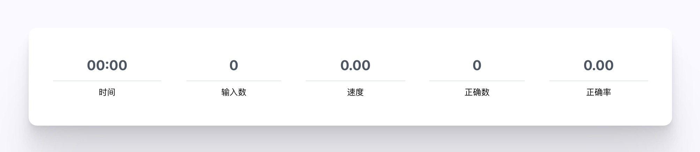

<div align=center>

</div>

<h1 align="center">
  Type to Learn
</h1>

<p align="center">
  <a href="../README.md">中文</a>
  <a href="./README_EN.md">English</a>
  <a href="./README_JP.md">日本語</a>
</p>

<p align="center">
  キーボードワーカーのために設計された単語記憶と英語筋肉記憶トレーニングソフトウェア
</p>

<p align="center">
  <a href="https://github.com/kazimkayhan/type-to-learn/blob/master/LICENSE"></a>
  <a></a>
  <a></a>
</p>

<div align=center>

</div>

## 📸 オンラインアクセス

**ライブサイト**: <https://kazimkayhan.github.io/type-to-learn/>

<br />

## ✨ 設計思想

このソフトウェアは、英語を主要な作業言語として使用するキーボードワーカーを対象としています。一部の人々は、母国語を入力する際の打鍵速度が英語よりも速いことがあります。これは、長年の母国語入力によって非常に強固な筋肉記憶が形成されているためです 💪。一方、英語入力の筋肉記憶は比較的弱く、英語を入力する際に「ペンを持つと忘れる」現象が発生しやすいです。

同時に、英語のスキルを強化するためには、単語の暗記を継続する必要があります 📕。このソフトウェアは、英語の単語記憶と英語キーボード入力の筋肉記憶のトレーニングを組み合わせており、単語を暗記しながら筋肉記憶を強化することができます。

誤った筋肉記憶を形成しないようにするために、設計上、ユーザーが単語を間違って入力した場合、単語を再入力する必要があります。これにより、ユーザーが正しい筋肉記憶を維持することができます。

このソフトウェアは、英語のコンピュータベースの試験を受ける必要がある人々にも役立ちます。

**For Coder**：

プログラマーが仕事でよく使う単語の辞書が内蔵されており、仕事でよく使う単語を練習し、入力速度を向上させることができます。また、多くのプログラミング言語の API の練習も内蔵されており、プログラマーが一般的な API に迅速に慣れるのに役立ちます。

<div align=center>

</div>

<br />

## 🛠 機能一覧

### 辞書

CET-4、CET-6、GMAT、GRE、IELTS、SAT、TOEFL、大学院英語、専門英語 4 級、専門英語 8 級などの一般的な辞書が内蔵されています。また、プログラマーがよく使う英単語や多くのプログラミング言語の API の辞書も内蔵されています。できる限り多くのユーザーの単語記憶のニーズを満たすよう努めており、コミュニティからのさらなる辞書の貢献も歓迎します。
<br />

### 音声記号表示、発音機能

単語を記憶する際に、発音と音声記号を同時に記憶するのに役立ちます。

<div align=center>

</div>
<br />

### 書き取りモード

ユーザーが章の練習を完了した後、その章を暗記するかどうかのオプションが表示されます。これにより、ユーザーがその章で学んだ単語を強化するのに役立ちます。

<div align=center>

</div>
<br />

### 速度、正確性の表示

ユーザーの入力速度と正確性を定量化し、ユーザーが自分のスキルの向上を実感できるようにします。

<div align=center>

</div>
<br />

## 📕 辞書リスト

本プロジェクトには豊富な辞書が内蔵されています：

### 英語学習
- CET-4、CET-6（大学英語四六級）
- GMAT、GRE、IELTS、SAT、TOEFL（留学試験）
- 大学院英語、専門英語 4 級、8 級
- 高校・中学英語
- ビジネス英語、BEC
- 新概念英語シリーズ

### プログラミング関連
- プログラマーがよく使う単語
- JavaScript、Node.js、Java、C#、Go、Python、Rust などの言語 API
- Linux コマンド

### その他の言語
- 日本語単語（N1-N5）
- カザフ語基礎単語
- ドイツ語、インドネシア語など

完全な辞書リストはアプリ内の辞書選択画面、または `src/resources/dictionary.ts` ファイルをご覧ください。

他の辞書が必要な場合は、GitHub Issues で提案するか、辞書を貢献してください。

<br />

## 貢献方法

### コードの貢献

[貢献ガイドライン](./CONTRIBUTING.md)

### 辞書の貢献

[辞書のインポート](./toBuildDict.md)

## プロジェクトの実行

このプロジェクトは **Vite + React + TypeScript + Tailwind CSS + shadcn/ui** を使用して構築されています。

### 環境要件

- **Node.js**: >=26
- **pnpm**: >=9（推奨: pnpm@12.4.2）
- **Git**

### インストール

1. プロジェクトをクローン：
   ```sh
   git clone https://github.com/kazimkayhan/type-to-learn.git
   cd type-to-learn
   ```

2. 依存関係をインストール：
   ```sh
   pnpm install
   ```

3. 開発サーバーを起動：
   ```sh
   pnpm start
   # または
   pnpm dev
   ```

4. ブラウザで `http://localhost:5173/` を開いてプロジェクトにアクセス

### プロダクションビルド

```sh
pnpm build
```

ビルド出力は `dist/` ディレクトリに生成され、GitHub Pages 用のベースパス `/type-to-learn/` で自動設定されます。

## 🏄‍♂️ 貢献ガイドライン

このプロジェクトに興味がある場合、貢献を歓迎します！以下の方法で参加できます：

- Issue を提出してバグを報告したり、機能を提案したりする
- Pull Request を提出してコードを改善したり、新機能を追加したりする
- 新しい辞書を貢献する（[辞書のインポート](./toBuildDict.md) を参照）

貢献前に [貢献ガイドライン](./CONTRIBUTING.md) をお読みください。

## 📄 ライセンス

本プロジェクトは [GPL-3.0](../LICENSE) ライセンスでオープンソース化されています。

## 🙏 謝辞

本プロジェクトは [qwerty-learner](https://github.com/RealKai42/qwerty-learner) のフォークです。原作者およびすべての貢献者の優れた仕事に感謝します。

## 👤 著者

**Kazim Kayhan**

- ウェブサイト: [kazimjan.com](https://kazimjan.com)
- GitHub: [@kazimkayhan](https://github.com/kazimkayhan)
- Email: email4kazim@gmail.com
